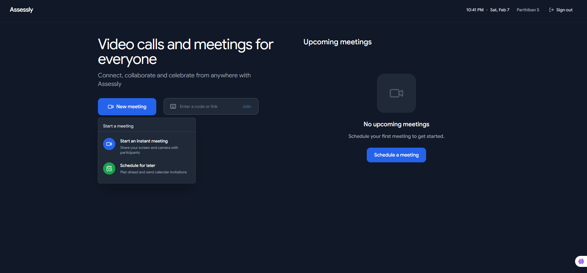
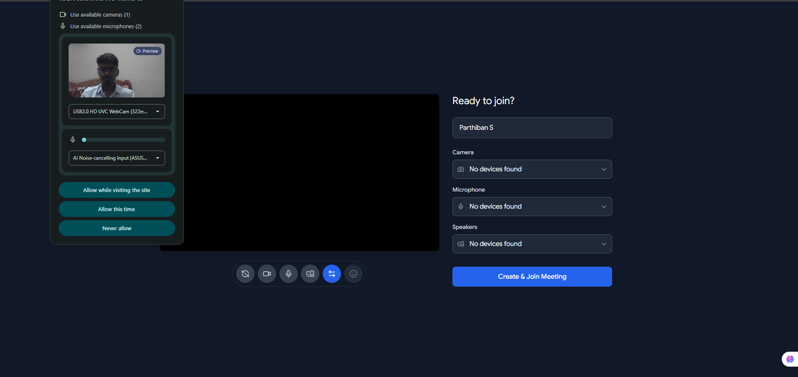
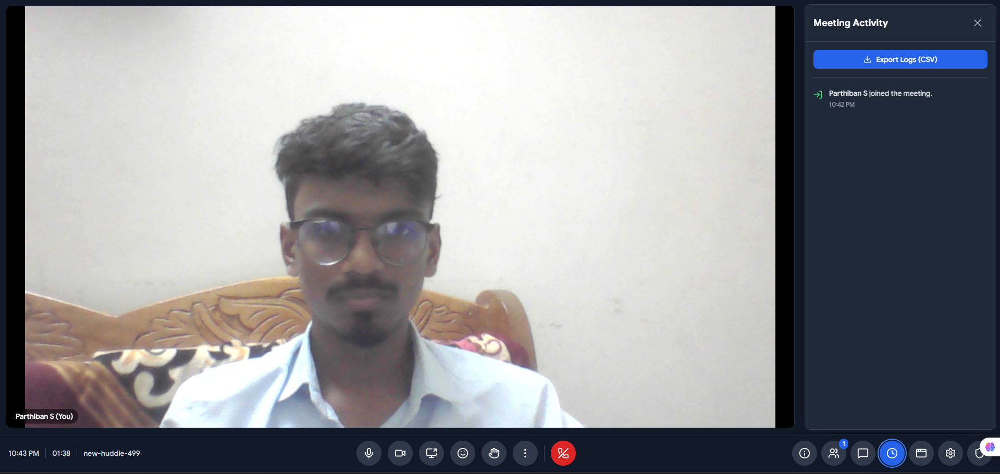
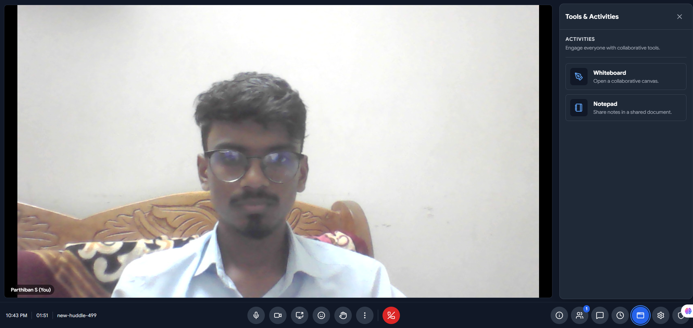
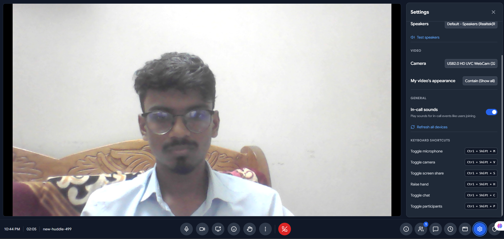
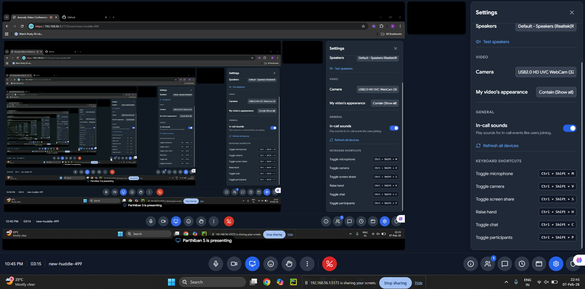

# Video Conferencing Platform (Showcase)

This repository serves as a **Code Showcase** demonstrating the architecture and engineering practices used in a private production-grade video conferencing application. As the original source code is proprietary, this repository contains **representative modules**, **architectural patterns**, and **mock implementations** of key components.

## 🚀 Project Overview

The original application is a real-time video communication platform built with **WebRTC (via Mediasoup)** for high-performance media handling and **Socket.IO** for signaling. It supports:
- Secure authentication (JWT + Bcrypt)
- Real-time video/audio meetings
- Screen sharing & chat
- Scalable SFU (Selective Forwarding Unit) architecture

## 🛠 Tech Stack

- **Backend**: Node.js, Express.js
- **Real-time Communication**: Mediasoup (SFU), Socket.IO
- **Database**: MongoDB (Mongoose)
- **Frontend**: React.js, Vite, TailwindCSS
- **State Management**: React Context / Hooks
- **DevOps**: Docker, Nginx, SSL (Let's Encrypt)

📸 Application Screenshots
1. Home Dashboard

The landing page provides users with quick access to:

New Meeting: Instantly start a video call
Join Meeting: Enter via code or link
Schedule for Later: Plan meetings with calendar invitations
Upcoming Meetings: View scheduled sessions at a glance

2. Pre-Meeting Setup

Before joining, users can:

Preview their camera feed
Test audio/microphone levels
Configure device permissions
Select preferred camera, microphone, and speakers
Choose whether to allow camera/microphone access temporarily or permanently

3. Active Meeting Interface

The main meeting view features:

Full-screen video display
Bottom control bar with quick actions:

Microphone toggle
Camera toggle
Screen sharing
Reactions/emoji
Raise hand
More options menu
Leave meeting (red button)


Real-time participant indicators
Meeting ID and duration tracking

4. Meeting Activity Panel

Track all meeting events with:

Export Logs (CSV): Download complete meeting activity
Real-time event feed showing:

Participant join/leave timestamps
Chat messages
Screen sharing events
Reactions and interactions


5. Collaborative Tools

Enhance collaboration with built-in tools:

Whiteboard: Real-time collaborative canvas for brainstorming
Notepad: Shared document for meeting notes and agendas
All participants can contribute simultaneously

6. Settings & Configuration

Comprehensive in-meeting settings:

Audio/Video Controls:

Speaker selection and testing
Camera selection
Video appearance settings (Contain/Show all)


General Options:

In-call sound notifications toggle
Device refresh capability


Keyboard Shortcuts:

Toggle microphone: Ctrl + Shift + M
Toggle camera: Ctrl + Shift + V
Toggle screen share: Ctrl + Shift + S
Raise hand: Ctrl + Shift + H
Toggle chat: Ctrl + Shift + C
Toggle participants: Ctrl + Shift + P


7. Screen Sharing in Action

Advanced screen sharing capabilities:

Share entire screen or specific windows
Participant notification when screen sharing is active
Presenter controls remain accessible
High-quality stream with minimal latency
Easy stop/pause controls


## 📂 Architecture & Directory Structure

```
/server
  ├── config.js         # Configuration management
  ├── server.js         # Entry point (HTTP + Socket server)
  ├── routes/           # REST API routes (Auth, Meetings)
  ├── socket/           # Socket.IO event handlers
  ├── models/           # Mongoose schemas
  └── utils/            # Helper functions (Logger, Error handling)

/client
  ├── src/
      ├── api/          # Axios instances & API calls
      ├── components/   # Reusable UI components
      ├── hooks/        # Custom React hooks (logic encapsulation)
      └── pages/        # Application pages
```

> **Detailed documentation and system diagrams are available in the [Architecture Guide](docs/ARCHITECTURE.md).**

## 🔒 Security Practices Demonstrated

- **Input Validation**: Uses `express-validator` to sanitize inputs.
- **Rate Limiting**: Protects login/register routes against brute force.
- **JWT Authentication**: Stateless, secure token-based auth.
- **Environment Variables**: Sensitive keys managed via `.env`.
- **Cors Policy**: Strict origin checks.

## 📝 Usage

1. **Install Dependencies**:
   ```bash
   cd server && npm install
   cd ../client && npm install
   ```
2. **Setup Environment**:
   Copy `.env.example` to `.env` in both server and client directories.
3. **Run**:
   ```bash
   # Server
   npm run dev
   # Client
   npm run dev
   ```

*Note: The Mediasoup logic in this showcase is mocked to demonstrate structure without requiring native build dependencies.*
