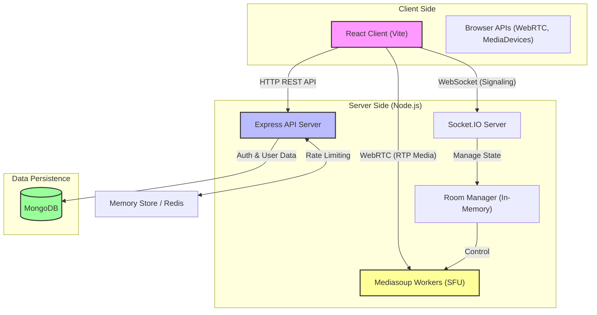
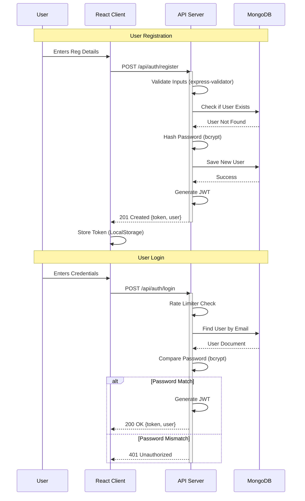
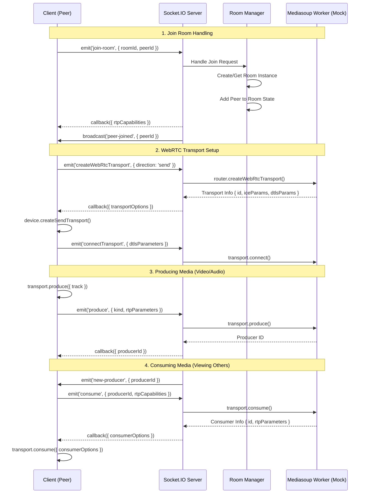
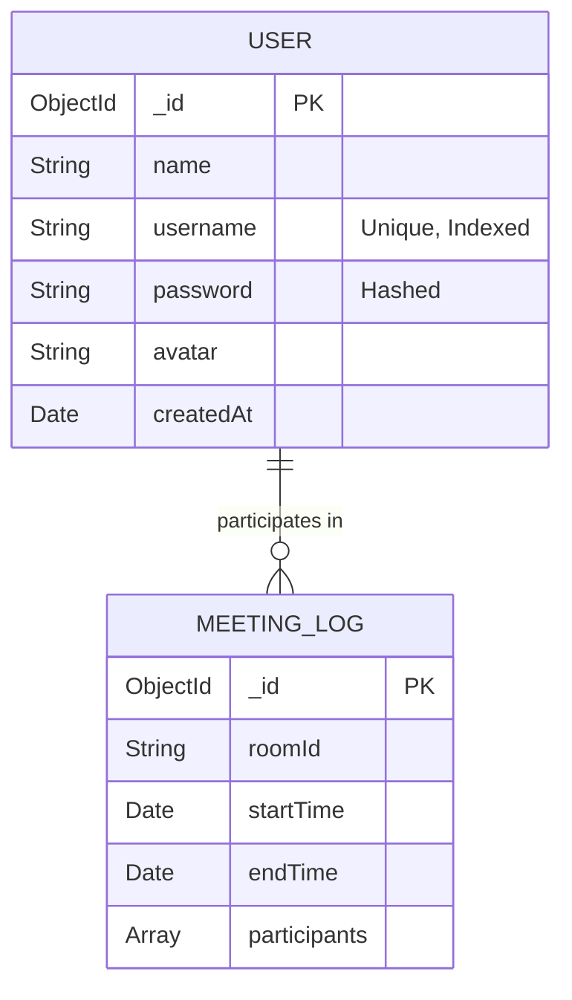
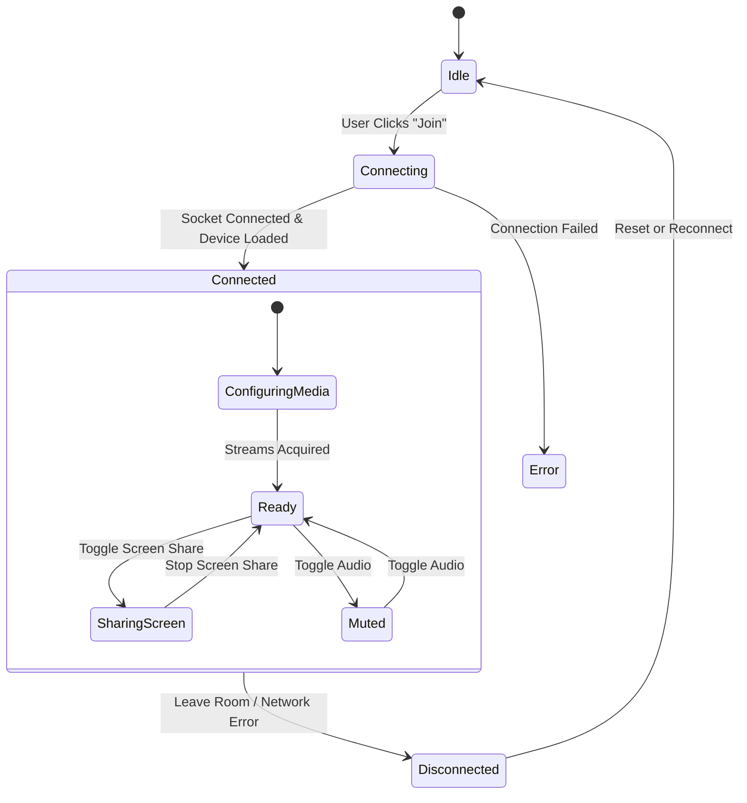

# System Architecture & Flows

This document details the system design, communication patterns, and data flows of the Video Conferencing application. The diagrams below illustrate the high-level architecture, authentication processes, and the core real-time signaling mechanism used for WebRTC connections.

---

## 1. High-Level System Architecture

This diagram illustrates the overall structure of the application, including the client-side React application, the Node.js/Express backend, the real-time Socket.IO layer, the Mediasoup SFU (Selective Forwarding Unit) workers, and the MongoDB database.

---

## 2. Authentication Flow (JWT)

This sequence diagram details the secure registration and login process. It highlights input validation, password hashing, and JWT token generation.

---

## 3. Real-Time Signaling & Room Join Flow

This is the core logic for video conferencing. It shows how a client joins a room via Socket.IO and initiates the WebRTC handshake with the Mediasoup SFU (simulated in this showcase).

---

## 4. Database Schema (ERD)

Although the primary focus is real-time media, the application maintains persistent user data.

## 5. Client State Management

The React client manages complex asynchronous state for media streams and socket connections.

